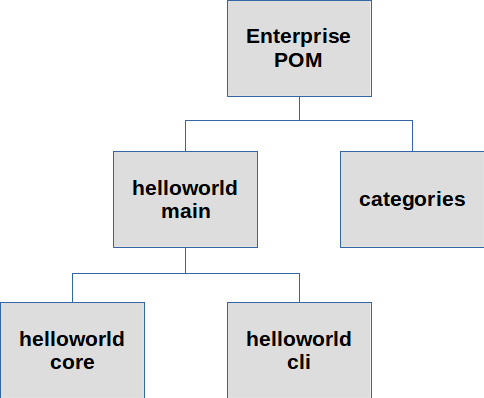

# Java Hello World

A sample project used in demonstrations and training.

The purpose of this project is not to display the text, "Hello, World!" The purpose is to demonstrate a practical Maven POM structure for enterprise Java applications.

At the top of the hierarchy is an "enterprise POM" that contains organization-wide standard declarations in the _dependencyManagement_ and _pluginManagement_ sections of the POM, as well as generic information like the name of the company. This POM inherets from the super POM.

At the next level are project POMs. Each of these is the top level POM for a project. Each inherets from the "enterprise POM."

Below the project POMs are the POMs for modules within projects.

With this structure, most of the verbose or complicated definitions are centralized in the "enterprise POM," making all the other POMs a bit simpler (or at least less cluttered) and less fragile.
